## Моя схема в Zapier

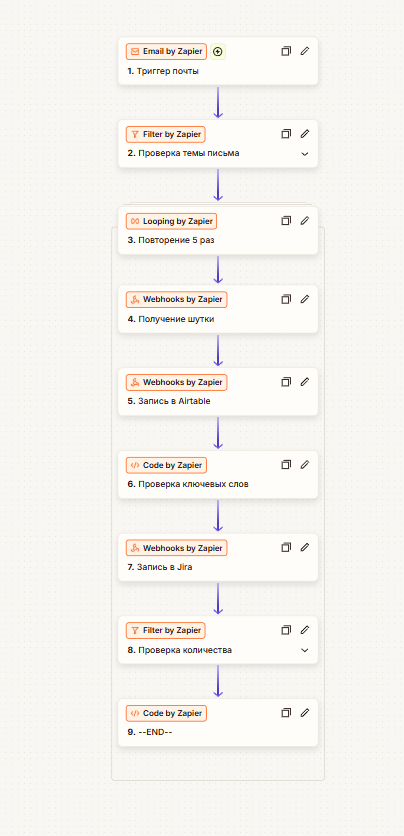

---

#### Триггер первой функции для запуска по заданию.

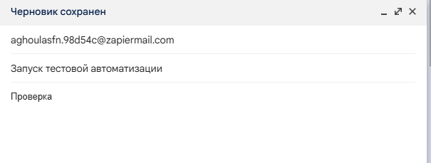

---

#### Вывод в Airtable.

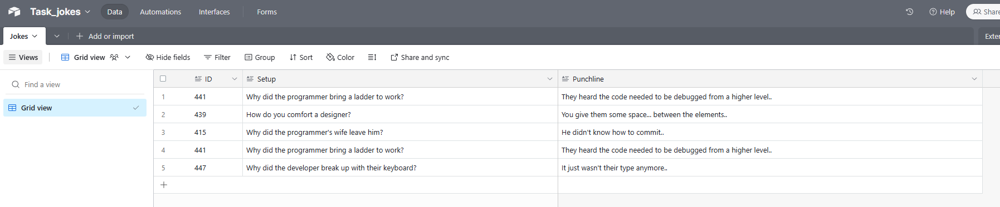

---

#### Вывод в Jira.

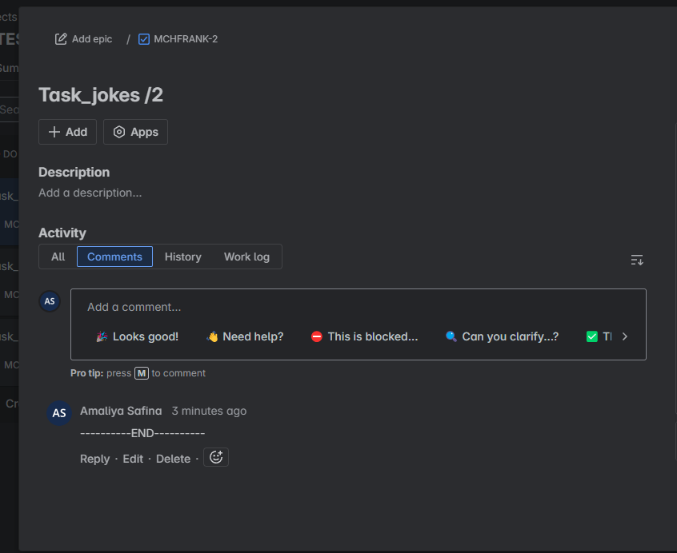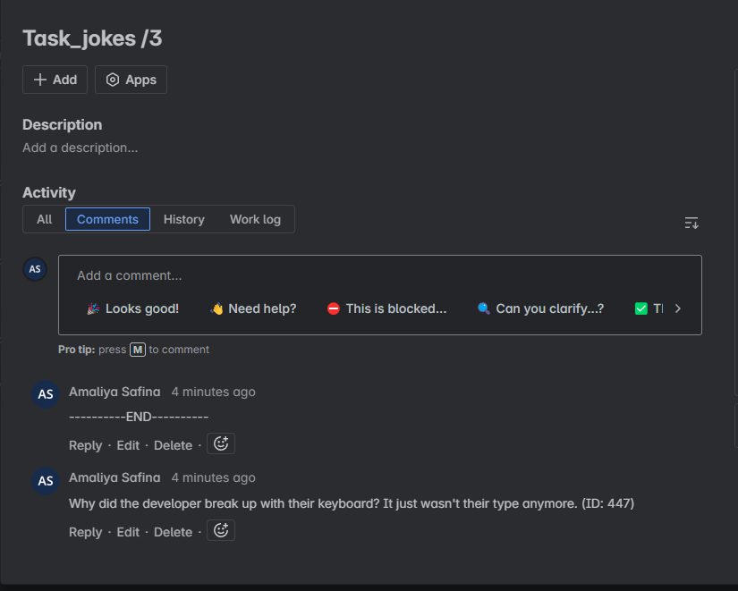

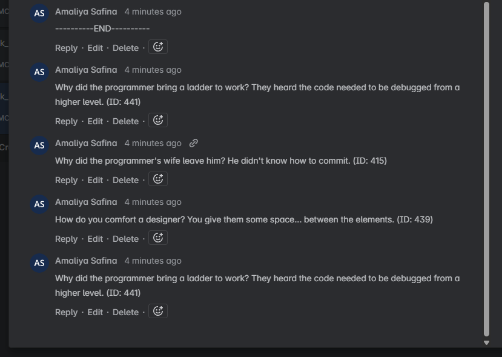

---

#### Более подробно по каждой функции в Zapier.

В задании было сказано, не использовать встроенные интеграции Jira и Airtable. Они не были использованы.

Понимаю, что задание можно выполнить куда эффективнее и проще и, скорее всего, не используя код совсем. Однако, мне хотелось сделать все более лаконичным, без разветвлений и, так как, в условии не было сказано, что это запрещено, так и было сделано.

---

###### Триггер почты настроен и работает.

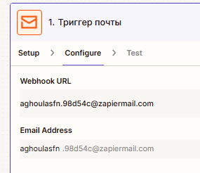

---

###### Проверка темы письма работает.

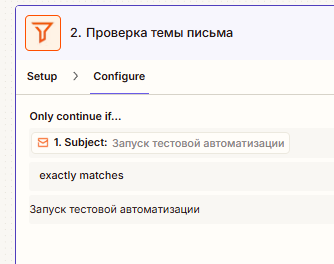

---

###### Повторение 5 раз через Loop, чтобы не делать много Webhooks.

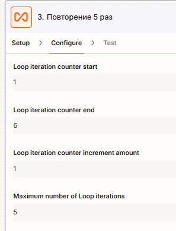

---

###### Получение шутки по заданию.

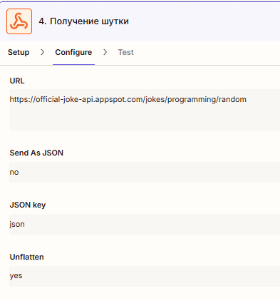

---

###### В Airtable был получен токен, который использовался для записи.

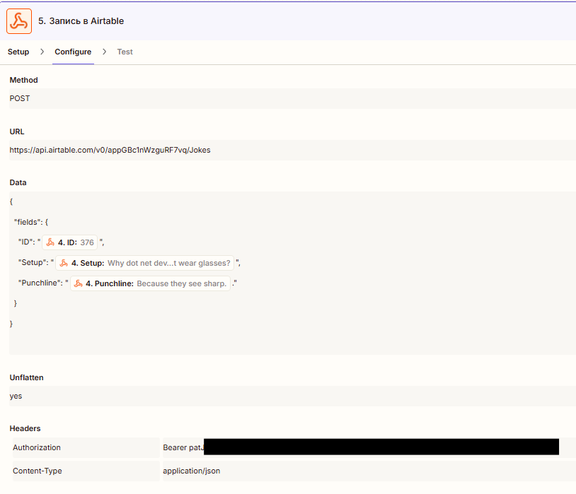

---

###### Проверка ключевых слов по заданию и проверка ID. Можно было сделать по другому, но, как и писала раньше, хотелось сделать меньше и проще. (По крайней мере для меня.)

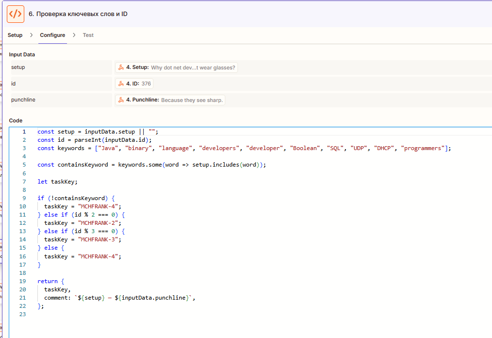

---

###### Запись в Jira. Ключ преобразован в Base64.

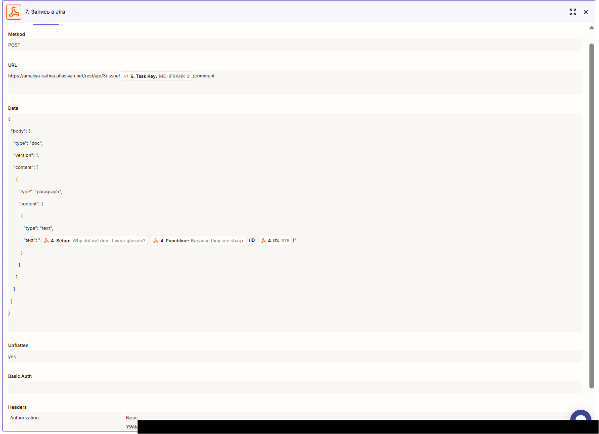

---

###### Простая проверка сколько раз прошел цикл.

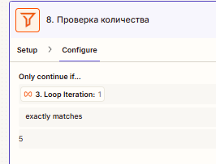

---

###### Вывод --END--, так как по условию не было совсем ясно выводить только в 1 TASK или все, вывожу во все с помощью кода. Заменить на вывод только одного намного проще.

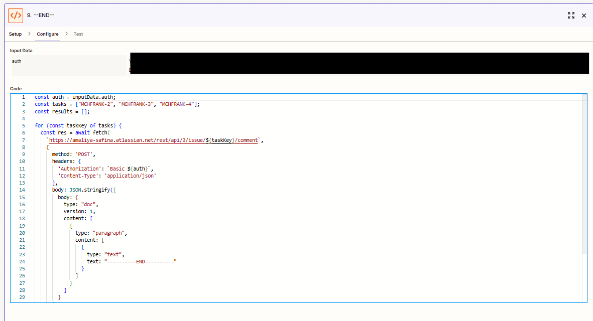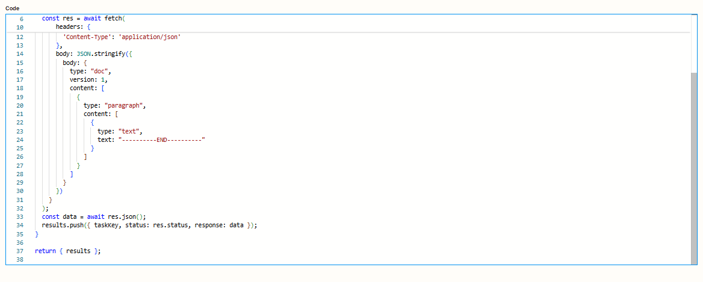
